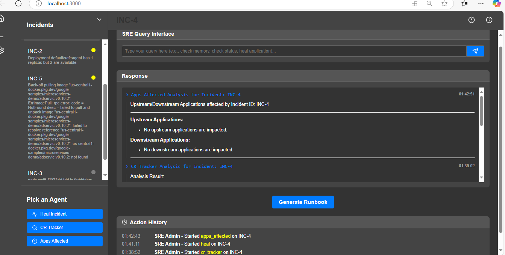

# 🚀 Platform Nexus

## 📌 Table of Contents
- [Introduction](#introduction)
- [Demo](#demo)
- [Inspiration](#inspiration)
- [What It Does](#what-it-does)
- [How We Built It](#how-we-built-it)
- [Challenges We Faced](#challenges-we-faced)
- [How to Run](#how-to-run)
- [Tech Stack](#tech-stack)
- [Team](#team)

---

## 🎯 Introduction

Tired of sifting through endless logs and juggling disparate tools? 
PlatformNexus is our solution to the plethora of IT operations.  
This platform streamlines critical workflows by providing an NLP-driven interface to LLMs and a suite of intelligent AI agents.  We're solving the problem of operational bottlenecks, enabling engineers to quickly diagnose incidents, automate remediation, and proactively manage their applications, ultimately leading to increased efficiency and reduced downtime.


## 🎥 Demo
🔗 [Live Demo](#) (if applicable)  
📹 [Video Demo](artifacts/demo/PlatformNexus.mp4) (if applicable)  
🖼️ Screenshots:




## 💡 Inspiration

We were inspired to create **Platform Nexus** by the transformative potential of AI, particularly LLMs, to revolutionize IT operations. The problem we identified is that while IT systems generate a wealth of data, extracting actionable insights and automating routine tasks remains a significant challenge. Engineers are often overwhelmed by manual processes and lack the tools to leverage this data effectively. PlatformNexus solves this by providing an NLP interface and intelligent AI agents that automate key workflows, allowing IT teams to harness the power of AI to streamline operations, improve efficiency, and drive innovation.


## ⚙️ What It Does

PlatformNexus provides a revolutionary approach to IT operations with these key features:

- **Natural Language Interface**: Engineers can interact with the platform using simple, conversational language, eliminating the need for complex commands or specialized syntax.  This lowers the barrier to entry and streamlines workflows.   
- **LLM Integration**: The platform leverages the power of Large Language Models (LLMs) in the backend to process natural language queries, understand user intent, and generate intelligent responses.  This enables sophisticated query processing and information retrieval.   
- **Specialized AI Agents**: PlatformNexus includes a suite of AI agents designed to automate specific IT operational tasks:
   - **Heal Agent**: Automates incident remediation by analyzing incident data, recommending resolution steps, and executing approved actions.    
   - **Change Request Tracker Agent**: Streamlines change request management by efficiently matching incidents with relevant change requests.    
   - **Application Dependency Eval Agent**: Analyzes application dependencies to understand the impact of incidents and changes, providing crucial context for decision-making.    
- **Unified UI**: The user interface provides a centralized dashboard with real-time incident monitoring, easy access to AI agents, and clear display of query results and relevant information. 


## 🛠️ How We Built It
- Created the UI using React with multiple panels.
- Used Python as backend for actions from the UI.
- Used OpenAI and Gemini LLM endpoints for summarization, generation and semantic analysis of content.
- Deployed sample apps, k8sgpt controllers and analyzers in Minikube for realtime app monitoring and to provide AI-powered analysis and actionable insights into cluster health and potential problems. 
- Used MCP to integrate with a data source derived from the metrics and data gathered by k8sgpt.
- Created AI agents using autogen for 3 different use cases to help in automation.

## 🚧 Challenges We Faced
### Technical Challenges ###
- Fine-tuning the prompts and ensuring accurate and relevant responses required careful experimentation and optimization.
- Development and orchestration of the specialized AI agents. 
- Using MCP to integrate with data source.
### Non-Technical Challenges ###
- Time constraints inherent in a hackathon environment were a major factor.
- Scoping the project to a manageable size for a hackathon was difficult. We had many ambitious ideas, but we had to make strategic decisions to focus on a core set of features that we could deliver within the given timeframe. This required careful prioritization and a willingness to postpone some interesting but less critical functionalities.


## 🏃 How to Run
1. Clone the repository  
   ```sh
   git clone  https://github.com/ewfx/gaipl-troubleshooters.git
   ```
2. Install dependencies  
   ```sh
   npm install
   pip install -r requirements.txt
   ```
3. Create `Minikube` and install `kubectl`
4. Deploy the manifests at `artifacts/demo/app-manifests.yaml` in the cluster  
   ```sh
   kubectl apply -f artifacts/demo/app-manifests.yaml
   ```
5. Run Python Backend  
   ```sh
   cd backend
   python app.py
   ```
   The server will start at http://127.0.0.1:5000.

6. Start React frontend  
   ```sh
   npm start
   ```
   Access the frontend at http://localhost:3000.


   

## 🏗️ Tech Stack
- 🔹 **Frontend**: React
- 🔹 **Backend**: Python
- 🔹 **Data Storage**: Local Filesystem, Blob Storage
- 🔹 **AI/ML**: OpenAI, Gemini, MCP, k8sgpt

## 👥 Team
- **Ajay Naik**
- **Hemant Nagpure**
- **Indumathy Thiagarajan** - [GitHub](https://github.com/t-indumathy) | [LinkedIn](https://linkedin.com/in/indumathy-thiagarajan)
- **Lakshmi Gopinathan** - [GitHub](https://github.com/lakshmigpnthn) | [LinkedIn](https://linkedin.com/in/lakshmigpnthn)
- **Prince Vijan**
